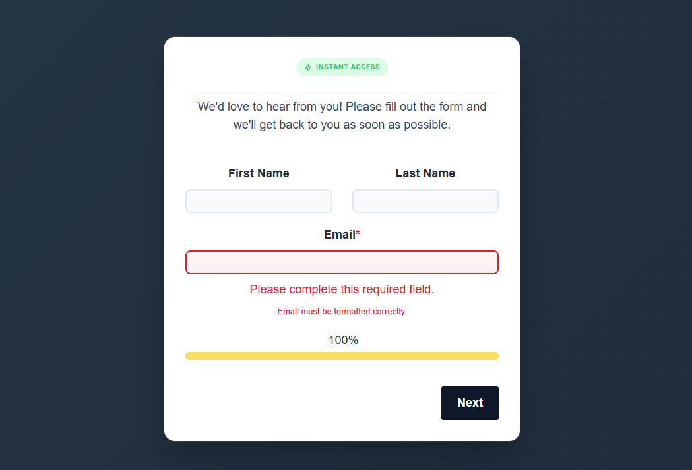

# Multistep Form Validation

> **Note on paths:** this README lives inside the `.module/` folder, so
> relative paths walk up two levels to reach the repo root.
> `.hsignore` excludes `**/README.md` so this file is never uploaded
> to your HubSpot portal.

## Description

Client-side per-step validation for HubSpot **HSFC** multi-step forms.
The module attaches to every `form.hsfc-Form` on the page, intercepts
React's step-advance behavior via a `MutationObserver`, and blocks
forward navigation until the current step's required fields pass
validation. Back navigation is always allowed.

The module itself renders no visible HTML — it only loads `module.js`,
which auto-initializes on `DOMContentLoaded` and wires up every HSFC
form it finds (including forms added later by lazy-loaded sections or
island hydration).

## Preview



## Category

modules

## Requirements

- HubSpot CMS Hub.
- A HubSpot form on the same page using the `hsfc-Form` class (standard
  for HubSpot Forms v4+).
- At least two steps — single-step forms are ignored.
- Required fields are driven entirely by HubSpot's backend settings:
  the module reads `aria-required="true"` and
  `.hsfc-FieldLabel__RequiredIndicator`. No per-field config is needed.

## Installation

Run from the repo root so `.hsignore` is honored:

```
hs upload modules/multistep-form-validation.module <remote-path>/multistep-form-validation.module
```

Then add the module to the same page as your HubSpot multi-step form.
It has no visible output — it only loads the validation JavaScript.

## Fields / Inputs

None. `fields.json` is `[]` — the module exposes no editor-facing
fields.

## Validation supported

| Field type    | Rule                                                          |
| ------------- | ------------------------------------------------------------- |
| Any required  | Must be non-empty                                              |
| Email         | Must match `^[^\s@]+@[^\s@]+\.[^\s@]{2,}$`                    |
| HSFC dropdown | Hidden-input value must be non-empty                          |
| Textarea      | Required rule applies                                          |

Errors show inline below the offending field (red border + red
message). Errors clear automatically as the user fixes the input.

## host_template_types

`PAGE`, `LANDING_PAGE`

## Notes & caveats

- The module guards against double-initialization via
  `window.__hscvActive`.
- The validation interception uses `MutationObserver` rather than
  native event listeners because React 17+ dispatches synthetic events
  on its own root container — `stopPropagation` on native events cannot
  cancel them. The observer lets React mutate the DOM, then reverses
  the mutation if the leaving step is invalid.
- Back navigation is never blocked, even from an invalid step.
- Single-step HSFC forms (only one `[data-hsfc-id="Step"]` element) are
  skipped.
